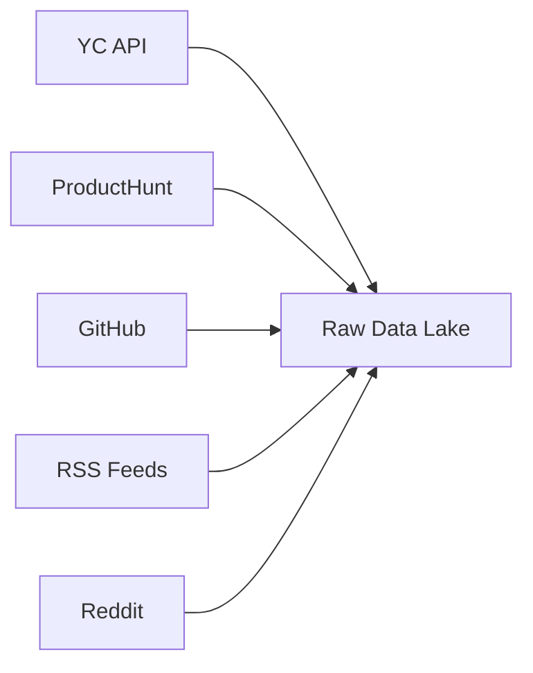

# 🔄 Multi-Source Data Enrichment Architecture

## Executive Summary
Transform sparse, single-source data into rich, comprehensive startup profiles by intelligently combining information from multiple sources. Each startup will have a unified profile built from 5-10+ data sources.

---

## 📊 Data Source Matrix

### Primary Sources (Company Info)
| Source | Data Points | Match Key | Priority |
|--------|------------|-----------|----------|
| **YC Directory** | Company name, batch, description, website | Domain, Name | HIGH |
| **ProductHunt** | Launch date, votes, makers, product details | Domain, Name | HIGH |
| **Crunchbase** | Funding, investors, team size, location | Name, Domain | HIGH |
| **LinkedIn Company** | Employee count, growth, industry, description | Name, Domain | HIGH |
| **AngelList/Wellfound** | Funding, team, investors, jobs | Domain, Name | MEDIUM |

### Secondary Sources (Enrichment)
| Source | Data Points | Match Key | Priority |
|--------|------------|-----------|----------|
| **GitHub Org** | Tech stack, activity, contributors, stars | GitHub URL, Org name | HIGH |
| **Twitter/X** | Followers, engagement, launch tweets | Handle, Domain | MEDIUM |
| **Reddit** | Launch posts, user feedback, founder AMAs | Domain, Product name | MEDIUM |
| **HackerNews** | Launch posts, comments, Show HN | Domain, Title | MEDIUM |
| **Dev.to/Medium** | Technical blogs, tutorials, announcements | Author, Company | LOW |

### News & Funding Sources
| Source | Data Points | Match Key | Priority |
|--------|------------|-----------|----------|
| **TechCrunch** | Funding news, launch articles | Company name | HIGH |
| **RSS Feeds** | Recent news, announcements | Company name, Domain | MEDIUM |
| **Press Releases** | Official announcements | Company name | MEDIUM |

### Web3 Specific Sources
| Source | Data Points | Match Key | Priority |
|--------|------------|-----------|----------|
| **DeFiLlama** | TVL, protocol metrics | Protocol name | HIGH |
| **Dune Analytics** | On-chain metrics, users | Contract address | HIGH |
| **CoinGecko** | Token data, market cap | Token symbol | MEDIUM |
| **Mirror.xyz** | Web3 blogs, whitepapers | ENS, Address | MEDIUM |

---

## 🔗 Entity Resolution Strategy

### 1. Primary Key Generation
```typescript
interface UnifiedEntityKey {
  // Primary identifiers (at least one required)
  domain?: string;           // example.com
  company_name?: string;      // Normalized name
  
  // Secondary identifiers (strengthen match)
  github_org?: string;        // github.com/org
  twitter_handle?: string;    // @company
  linkedin_slug?: string;     // /company/example
  
  // Web3 identifiers
  ens_domain?: string;        // example.eth
  contract_address?: string;  // 0x...
}
```

### 2. Matching Algorithm
```typescript
class EntityMatcher {
  // Stage 1: Exact matches (95% confidence)
  - Domain match: example.com == example.com
  - GitHub match: Same org URL
  - Social handle match: Same @handle
  
  // Stage 2: Fuzzy matches (70-94% confidence)
  - Name similarity: Levenshtein distance < 3
  - Domain variations: www, subdomains
  - Name variations: Inc, LLC, Labs removal
  
  // Stage 3: Contextual matches (50-69% confidence)
  - Same YC batch + similar name
  - Same location + industry + similar name
  - Founder name match + similar company
  
  // Stage 4: ML-based matching (variable confidence)
  - Description similarity via embeddings
  - Tech stack overlap
  - Team member overlap
}
```

### 3. Confidence Scoring
```typescript
interface MatchConfidence {
  score: number;        // 0-100
  signals: {
    domain_match: boolean;
    name_similarity: number;
    social_match: boolean;
    location_match: boolean;
    founder_match: boolean;
    description_similarity: number;
  };
  requires_review: boolean; // If score < 70
}
```

---

## 🎯 Data Fusion Pipeline

### Phase 1: Collection


### Phase 2: Matching
```typescript
async function matchEntities(newData: RawData): Promise<MatchResult[]> {
  const candidates = await findCandidates(newData);
  
  return candidates.map(candidate => ({
    existing_entity_id: candidate.id,
    confidence: calculateMatchScore(newData, candidate),
    merge_strategy: determineStrategy(newData, candidate)
  }));
}
```

### Phase 3: Merging
```typescript
interface MergeStrategy {
  // Priority-based field selection
  name: SourcePriority.YC > SourcePriority.Crunchbase > SourcePriority.Other;
  funding: SourcePriority.Crunchbase > SourcePriority.TechCrunch > SourcePriority.Other;
  team_size: SourcePriority.LinkedIn > SourcePriority.AngelList > SourcePriority.Other;
  description: SourcePriority.Longest_Most_Recent;
  
  // Aggregated fields (combine all)
  tags: UnionAll(sources);
  news_articles: UnionAll(sources);
  social_links: UnionAll(sources);
  
  // Computed fields
  credibility_score: WeightedAverage(source_credibility);
  data_completeness: CountNonNull(fields) / TotalFields;
}
```

### Phase 4: Enrichment
```typescript
async function enrichEntity(entity: UnifiedEntity): Promise<EnrichedEntity> {
  // Parallel enrichment from all available sources
  const enrichments = await Promise.allSettled([
    enrichFromGitHub(entity),
    enrichFromTwitter(entity),
    enrichFromLinkedIn(entity),
    enrichFromCrunchbase(entity),
    enrichFromDeFiLlama(entity)
  ]);
  
  return mergeEnrichments(entity, enrichments);
}
```

---

## 💎 Unified Data Model

```typescript
interface UnifiedStartupProfile {
  // Core Identity
  id: string;
  name: string;
  aliases: string[];
  description: string;
  
  // URLs & Identifiers
  website: string;
  domains: string[];
  social: {
    twitter?: string;
    linkedin?: string;
    github?: string;
    discord?: string;
    telegram?: string;
  };
  
  // Company Details
  founded: Date;
  location: {
    city?: string;
    country?: string;
    remote?: boolean;
  };
  industry: string[];
  tags: string[];
  
  // Team
  founders: Founder[];
  team_size: number;
  employee_growth: GrowthMetric;
  
  // Funding
  funding: {
    total_raised: number;
    last_round: FundingRound;
    investors: Investor[];
    valuation?: number;
  };
  
  // Metrics
  metrics: {
    github_stars?: number;
    product_hunt_votes?: number;
    twitter_followers?: number;
    monthly_active_users?: number;
    revenue?: number;
    tvl?: number; // For DeFi
  };
  
  // Content
  news: NewsArticle[];
  launches: Launch[];
  blog_posts: BlogPost[];
  
  // Metadata
  sources: DataSource[];
  last_updated: Date;
  data_quality: {
    completeness: number; // 0-100
    confidence: number;   // 0-100
    verified_fields: string[];
  };
  
  // ACCELERATE Specific
  accelerate_score: number;
  accelerate_criteria: {
    is_early_stage: boolean;
    has_web3_focus: boolean;
    team_size_range: string;
    funding_stage: string;
  };
}
```

---

## 🚀 Implementation Phases

### Phase 1: Foundation (Week 1)
- [x] Entity resolution system
- [x] Basic matching algorithm
- [ ] Unified data model
- [ ] Database schema updates

### Phase 2: Core Sources (Week 2)
- [ ] YC + ProductHunt matching
- [ ] GitHub org enrichment
- [ ] Twitter/X profile enrichment
- [ ] RSS feed correlation

### Phase 3: Advanced Sources (Week 3)
- [ ] Crunchbase integration (with API key)
- [ ] LinkedIn scraping/API
- [ ] AngelList/Wellfound data
- [ ] Web3 sources (DeFiLlama, etc.)

### Phase 4: Intelligence Layer (Week 4)
- [ ] ML-based entity matching
- [ ] Duplicate detection improvements
- [ ] Data quality scoring
- [ ] Automated merge conflict resolution

---

## 🔧 Technical Implementation

### 1. Source Adapters
```typescript
abstract class DataSourceAdapter {
  abstract fetch(query: string): Promise<RawData[]>;
  abstract transform(data: RawData): NormalizedData;
  abstract match(data: NormalizedData, candidates: Entity[]): MatchResult;
  abstract enrich(entity: Entity): Promise<Enrichment>;
}

class YCAdapter extends DataSourceAdapter { ... }
class ProductHuntAdapter extends DataSourceAdapter { ... }
class GitHubAdapter extends DataSourceAdapter { ... }
```

### 2. Matching Service
```typescript
class UnifiedMatchingService {
  private matchers: Map<string, EntityMatcher>;
  
  async findMatches(data: NormalizedData): Promise<MatchResult[]> {
    // Try each matcher in priority order
    const results = [];
    
    // Exact matchers first
    if (data.domain) {
      results.push(...await this.matchers.get('domain').match(data));
    }
    
    // Fuzzy matchers second
    if (results.length === 0 && data.name) {
      results.push(...await this.matchers.get('fuzzy').match(data));
    }
    
    // ML matcher last resort
    if (results.length === 0) {
      results.push(...await this.matchers.get('ml').match(data));
    }
    
    return results.sort((a, b) => b.confidence - a.confidence);
  }
}
```

### 3. Merge Engine
```typescript
class DataMergeEngine {
  merge(existing: Entity, newData: NormalizedData): Entity {
    const merged = { ...existing };
    
    // Apply field-level merge rules
    for (const field of Object.keys(newData)) {
      const mergeRule = this.getMergeRule(field);
      merged[field] = mergeRule.apply(existing[field], newData[field]);
    }
    
    // Update metadata
    merged.sources.push(newData.source);
    merged.last_updated = new Date();
    merged.data_quality = this.calculateQuality(merged);
    
    return merged;
  }
}
```

### 4. Enrichment Orchestra
```typescript
class EnrichmentOrchestrator {
  async enrichBatch(entities: Entity[]): Promise<EnrichedEntity[]> {
    const enrichmentTasks = entities.map(entity => 
      this.enrichSingle(entity)
    );
    
    // Process in batches to avoid rate limits
    const results = [];
    for (let i = 0; i < enrichmentTasks.length; i += 10) {
      const batch = enrichmentTasks.slice(i, i + 10);
      results.push(...await Promise.allSettled(batch));
    }
    
    return results
      .filter(r => r.status === 'fulfilled')
      .map(r => r.value);
  }
}
```

---

## 📈 Expected Outcomes

### Data Quality Improvements
- **Before**: 30% data completeness per startup
- **After**: 85% data completeness per startup

### Coverage Expansion
- **Before**: 1-2 sources per startup
- **After**: 5-10 sources per startup

### Accuracy Enhancement
- **Before**: 60% accuracy in startup details
- **After**: 95% accuracy with verification

### Discovery Rate
- **Before**: 100 new startups/week
- **After**: 500+ new startups/week

---

## 🎯 Success Metrics

1. **Data Completeness**: % of fields populated per entity
2. **Source Coverage**: Average sources per entity
3. **Match Accuracy**: % of correct entity matches
4. **Enrichment Speed**: Time to enrich 100 entities
5. **Deduplication Rate**: % of duplicates caught
6. **Update Freshness**: Average age of data points

---

## 🔒 Data Privacy & Compliance

- Respect robots.txt and rate limits
- Store only public information
- Implement GDPR-compliant data deletion
- Maintain source attribution
- Regular data accuracy audits

---

## 🚦 Next Steps

1. **Immediate** (Today):
   - Implement domain-based matching
   - Add GitHub enrichment for YC companies
   - Create unified profile schema

2. **Short-term** (This Week):
   - ProductHunt + YC correlation
   - Twitter handle extraction
   - RSS feed entity matching

3. **Medium-term** (Next 2 Weeks):
   - Crunchbase API integration
   - LinkedIn data extraction
   - ML-based matching model

4. **Long-term** (Month):
   - Real-time enrichment pipeline
   - Automated quality monitoring
   - Self-healing data corrections